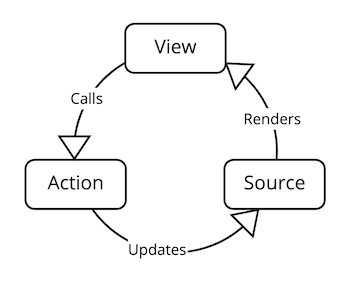

# Source Architecture

Source Architecture is an incredibly streamlined iOS framework for building reactive, highly testable, and scalable iOS apps. The framework has a minimal footprint for use with new or existing code, and shared data sources can power screens built with UIKit or SwiftUI.

## Overview



Source Architecture has only three core types:

- **Source** — a class that manages some piece of information, such as a user, a to-do list item, or a persisted setting. A Source exposes a current value and also updates subscribers with new values.
- **Renderer** — a protocol for a screen or view that presents information to the user and handles user input. With Source Architecture, a SwiftUI View, a UIViewController, a UITableViewCell, or other UIViews can all be Renderers. A Renderer must have a property called `model` that is a Source of whatever information it wants to present. For UIKit views, Renderers will also have a method called `render()`.
- **Action** — a way to trigger some behavior in response to events or user input without knowing where the behavior is implemented.

The following code is an example of how to use all three types. The code demonstrates how a Source and Renderer show a random quote to the user.

First, we will decide what information will need to be shown by the Renderer and implement the View in SwiftUI:

```swift
import SwiftUI
import SourceArchitecture

struct QuoteView: View, Renderer {

  // This is the model we will render.
  // The model contains a quote, an author and an Action.
  // The Action gets a new quote when the user taps a button.
  struct Model {
    let quote: String
    let author: String
    let getRandomQuote: Action<Void>
  }

  // Renderers have a property called "model" that is a Source of the type to be rendered.
  @Source var model: Model

  init(source: Source<Model>) {
      _model = source
  }

  var body: some View {
    VStack {
      Text("\"" + model.quote + "\"").multilineTextAlignment(.center)
      Text("— " + model.author)
          .frame(maxWidth: .infinity, alignment: .trailing)
          .padding(.vertical, 20)
      Button("Get Random Quote") { model.getRandomQuote() }.buttonStyle(.borderedProminent)
    }.padding()
  }
}
```

This is now a fully functioning screen that shows a quote, the author, and will trigger the retrieval and rendering of a new quote when the button is tapped! Using SwiftUI previews, we can pass in a placeholder Source and see how it all works.

```swift
struct QuoteView_Previews: PreviewProvider {
  static var previews: some View {
    let model = QuoteView.Model(quote: "Just a placeholder quote for development previews", 
                                author: "Yourself", 
                                getRandomQuote: .doNothing)
    let placeholder = Source(wrappedValue: model)
    QuoteView(source: placeholder)
  }
}
```


To create the QuoteView, we need to provide a Source of its Model for it to render. In the example above, we passed in a placeholder with fake data. Now we will create a dynamic Source to retrieve quotes from the internet.

For this example, we will use the endpoint: `http://quotes.stormconsultancy.co.uk/random.json`

First, we create a Source of QuoteView's Model by using a subclass:

```swift
final class QuoteViewSource: SourceOf<QuoteView.Model> {
    
}
```

Next, we will create the Action that this Source will provide to get a new random quote:

```swift
final class QuoteViewSource: SourceOf<QuoteView.Model> {

  // To create an Action, the Source declares an @Action property with the method it should invoke.
  @Action(QuoteViewSource.getRandomQuote) private var getRandomQuoteAction

  private func getRandomQuote() {
    let url = URL(string: "http://quotes.stormconsultancy.co.uk/random.json")!
    URLSession.shared.dataTask(with: URLRequest(url: url)) { [weak self] data, _, _ in
      if let self = self, 
         let data = data, 
         let quote = try? JSONDecoder().decode(QuoteResponse.self, from: data) {
        // Renderers will be updated automatically when the `model` property is updated.
        self.model = .init(quote: quote.quote, 
                           author: quote.author, 
                           getRandomQuote: self.getRandomQuoteAction)
      }
    }.resume()
  }
}
```

For the above JSON decoding to work, we need to create a Decodable QuoteResponse like this:

```swift
private struct QuoteResponse: Decodable {
    let quote: String
    let author: String
}
```

Lastly, subclassing `SourceOf` requires our Source to define an initial value for its Model. We will add that property as well as an initializer which kicks off the initial fetch of a random quote:

```swift
final class QuoteViewSource: SourceOf<QuoteView.Model> {

  ...
  
  lazy var initialModel = QuoteView.Model(quote: "", author: "", getRandomQuote: getRandomQuoteAction)
  
  override init() {
    super.init()
    getRandomQuote() // Kick off the fetch of the first quote
  }
}

private struct QuoteResponse: Decodable {
    let quote: String
    let author: String
}
```

That's it! We can now instantiate this real Source in our preview and see the screen render random quotes from the endpoint! The button works to get a new random quote as well. 

```swift
struct QuoteView_Previews: PreviewProvider {
  static var previews: some View {
    // Now we can use our real implementation instead of the placeholder.
    QuoteView(source: QuoteViewSource().eraseToSource())
  }
}
```

> Note: You can use Combine publishers, async / await, Actors, or any other paradigm when working with Source Architecture. The only requirement a Source has is to 1) define an initial value for its model and 2) set its `model` property with new values when they should change.

Our final result looks like this:

```swift
import SwiftUI
import SourceArchitecture

struct QuoteView: View, Renderer {

  // This is the model we will render.
  // The model contains a quote, an author and an Action.
  // The Action gets a new quote when the user taps a button.
  struct Model {
    let quote: String
    let author: String
    let getRandomQuote: Action<Void>
  }

  // Renderers have a property called "model" that is a Source of the type to be rendered.
  @Source var model: Model

  init(source: Source<Model>) {
      _model = source
  }

  var body: some View {
    VStack {
      Text("\"" + model.quote + "\"").multilineTextAlignment(.center)
      Text("— " + model.author)
          .frame(maxWidth: .infinity, alignment: .trailing)
          .padding(.vertical, 20)
      Button("Get Random Quote") { model.getRandomQuote() }.buttonStyle(.borderedProminent)
    }.padding()
  }
}

struct QuoteView_Previews: PreviewProvider {
  static var previews: some View {
    // Now we can use our real implementation instead of the placeholder.
    QuoteView(source: QuoteViewSource().eraseToSource())
  }
}

final class QuoteViewSource: SourceOf<QuoteView.Model> {

  // To create an Action, the Source declares an @Action property with the method it should invoke.
  @Action(QuoteViewSource.getRandomQuote) private var getRandomQuoteAction
  
  lazy var initialModel = QuoteView.Model(quote: "", author: "", getRandomQuote: getRandomQuoteAction)
  
  override init() {
    super.init()
    getRandomQuote() // Kick off the fetch of the first quote
  }

  private func getRandomQuote() {
    let url = URL(string: "http://quotes.stormconsultancy.co.uk/random.json")!
    URLSession.shared.dataTask(with: URLRequest(url: url)) { [weak self] data, _, _ in
      if let self = self, 
         let data = data, 
         let quote = try? JSONDecoder().decode(QuoteResponse.self, from: data) {
        // Renderers will be updated automatically when the `model` property is updated.
        self.model = .init(quote: quote.quote, 
                           author: quote.author, 
                           getRandomQuote: self.getRandomQuoteAction)
      }
    }.resume()
  }
}

private struct QuoteResponse: Decodable {
    let quote: String
    let author: String
}
```


In about fifty lines of code, we created a small app that displays a screen with a quote and author from a JSON endpoint and a button that will fetch and display a new random quote when tapped. We also got a quick look at the **Source**, **Renderer**, and **Action** core Source Architecture types along the way.

## What's Different About Source Architecture?

#### Model-defined API instead of Protocol-defined API

Most architectural patterns rely on protocols to define what data and behaviors (API) will be available to client code. This is a perfectly workable approach, but it adds quite a bit of overhead in terms of creating the protocol and multiple conforming types. For example:

```swift
protocol AuthenticationProvider {
  var isAuthenticated: Bool { get }
  var authToken: String? { get }
  var authError: Error? { get }
  func logInWithCredentials(_ credentials: Credentials)
  func logOut()
}

class AuthenticationManager: AuthenticationProvider {
  var isAuthenticated: Bool
  var authToken: String?
  var authError: Error?
  func logInWithCredentials(_ credentials: Credentials) {
      // Add implementation
  }

  func logOut() {
      // Add implementation
  }
}

class MockAuthenticationManager: AuthenticationProvider {
  var isAuthenticated: Bool
  var authToken: String?
  var authError: Error?
  func logInWithCredentials(_ credentials: Credentials) {
      // Add mock implementation
  }

  func logOut() {
      // Add mock implementation
  }
}
```

Protocol-based APIs like this can also run the risk of retain cycles, if for example the provider also retains the view.

In contrast, Source Architecture defines all API in the Model types themselves. Models are structs or enums which contain both data and Actions. In contrast to the above protocol based approach, Source Architecture would expose the API like this:

```swift
struct AuthenticationModel {
  let isAuthenticated: Bool
  let authToken: String?
  let authError: Error?
  let logInWithCredentials: Action<Credentials>
  let logOut: Action<Void>
}
```

Regardless of protocol conformance, anything can now provide an instance or stream of these Models populated with the appropriate data and Actions. In a testing example, instead of implementing a `MockAuthenticationManager` and conforming it to the AuthenticationProvider protocol, we can do this:

```swift
let loginAction = Action<Credentials> { loginExpectation.fulfill() }
let logOutAction = Action<Void> { XCTFail("logOut should not have been called") }
let mockAuthenticationModel = AuthenticationModel(isAuthenticated: false, 
                                                  authToken: nil,
                                                  authError: nil,
                                                  logInWithCredentials: loginAction,
                                                  logOut: logOutAction)
testSubject = .init(authModel: mockAuthenticationModel)
```

We no longer have the overhead of creating protocols and other conforming types. Instead, you can write less code and simpler code.

Beyond preventing extraneous code, the Model-defined approach allows for much better self-documenting APIs, which require fewer tests. Many of these APIs are not possible with the protocol-defined approach.

For example, in our AuthenticationProvider protocol above, there are implicit rules that aren't clear to client developers.

- The `logOut()` method should only be called if `isAuthenticated == true`, otherwise it doesn't make sense
- The `logInWithCredential()` method should only be called if `isAuthenticated == false`
- The `authToken` property must ***always*** be `nil` if `isAuthenticated == false` and must ***never*** be nil if `isAuthenticated == true`
- The `authError` property must ***always*** be `nil` if `isAuthenticated == true`


All these implicit rules must be implemented in every type conforming to the protocol, with defensive coding to check for the right conditions. Extra unit tests are required for every bullet point above.

If only there were a way to make these rules explicit and guaranteed using the type system... and in Swift, of course, there is a way! Here is a **much** better way of modeling the API and the approach that Source Architecture was designed to support:

```swift
enum AuthenticationModel {
  case notAuthenticated(NotAuthenticated)
  case authenticated(Authenticated)
  
  struct NotAuthenticated {
    let authError: Error?
    let logInWithCredentials: Action<Credentials>
  }
  
  struct Authenticated {
    let authToken: String
    let logOut: Action<Void>
  }
}
```

Notice that now the type system explicitly guarantees the four rules we stated above. The `logIn` and `logOut` actions can only be called in the right state and don't even exist in the wrong state. The `authToken` only exists in an `.authenticated` state and doesn't exist in the `.notAuthenticated` state. 

So, by modeling the API this way, what have we improved?

- The API is now self-documenting because developers can clearly see what properties are available when and when each action is allowed to be called. It's not even _possible_ to accidentally call the wrong thing at the wrong time since autocomplete won't suggest it, and the compiler won't accept it.

- Eliminated the need to write defensive code to ensure that the write actions are only called at the right time

- Eliminated the need to write at least 4 unit tests

- As a bonus, we removed optionality from the `authToken` property and don't need a separate `isAuthenticated` optional property anymore because the case itself carries that information. Less optionality means fewer conditional paths that developers have to consider!


In Source Architecture, the framework makes it easy to write and use Model-defined API.

> Note: Model-defined API also guarantees that Actions from previous states can't be saved and called later in the wrong state and ensures that Actions are created and executed by the same Source that owns the data.

#### Every Source is a simple state machine

In Source Architecture, the basic unit of logic is a Source. A Source is the single source of truth for a piece of information and controls all modifications and transactions (saving, fetching, etc.) related to that information. As we saw above, our Models can have multiple states, with different Actions available in each state which are capable of transitioning the Model to a new state (like from `.notAuthenticated` to `.authenticated`)

Source Architecture greatly simplifies this and prevents much boilerplate code from setting up such state machines. To implement a Source that manages the `AuthenticationModel` state we described above, it's as simple as:

```swift
final class AuthManager: SourceOf<AuthenticationModel> {
  @Action(AuthManager.logIn) var logInAction // Connect Action to private method
  @Action(AuthManager.logOut) var logOutAction // Connect Action to private method

  // Specifiying an intial value for the model is the single CustomSource requirement
  lazy var initialModel: AuthenticationModel 
    = .notAuthenticated(.init(error: nil, logInWithCredentials: logInAction))

  private func logIn(_ credentials: Credentials) {
    // Send credentials to API and wait for response
    switch result {
    case .success(let token):
      model = .authenticated(.init(authToken: reponse.authToken, logOut: logOutAction))
    case .failure(let error)
      model = .notAuthenticated(.init(error: error, logInWithCredentials: logInAction))  
    }
  }

  private func logOut() {
    model = .notAuthenticated(.init(error: nil, logInWithCredentials: logInAction))
  }
}
```

Now, any observer can get the current value of the AuthenticationModel, or get a stream of updated Models emitted whenever the state changes:

```swift
// We always erase the concrete type and just reference a Source of the Model
let authSource: Source<AuthenticationModel> = AuthManager().eraseToSource()

// Get the the current value of the AuthenticationModel
let currentModel = authSource.model

// Subscribe to stream of Model changes
authSource.subscribe(self, method: Self.handleAuthChange)
func handleAuthChange(_ model: AuthenticationModel) {
  // This method will get called every time the model changes, with the latest value
}
```  

#### UIKit works just like SwiftUI and is powered by the exact same Sources of data

In Source Architecture, any view type which should present updating data to the user simply conforms to the `Renderer` protocol. (Whether a SwiftUI View, UIViewController, UITableViewCell, etc.)  This protocol only requires the view to have an @Source property named "model" with the type of the model the view wants to display (analogous to "view model" or "view state"). For SwiftUI Views, that's the only requirement. For non-SwiftUI views, there must also be a method named `render()`, which will be called automatically when the model is updated.

Here is a simplified SwiftUI View which shows the status of a coworker, using Source Architecture:

```swift
struct CoworkerStatus {
    let name: String
    let avatar: UIImage
    let isOnline: Bool
    let statusMessage: String
}

// Note the SourceArchitecture Renderer protocol
struct StatusView: View, Renderer {
  // The Render protocol requires this property using the @Source property wrapper
  @Source model: CoworkerStatus

  var body: some View {
    VStack {
      HStack {
        Circle()
          .foregroundColor(model.isOnline ? .green : .red)
          .frame(width: 10, height: 10)
        Image(model.avatar)
        Text(model.name)
      }
      Text(model.statusMessage)
  }
}
```

Here is a simplified example of an equivalent screen implemented as a UIViewController from a Storyboard:

```swift
struct CoworkerStatus {
    let name: String
    let avatar: UIImage
    let isOnline: Bool
    let statusMessage: String
}

// Note the Renderer protocol again
final class StatusView: UIVIewController, Renderer { 
  @IBOutlet private var image: UIImageView!
  @IBOutlet private var indicator: UIView!
  @IBOutlet private var name: UILabel!
  @IBOutlet private var statusMessage: UILabel!

  // Note that this is the same property wrapper used for both SwiftUI and UIKit
  @Source var model: CoworkerStatus

  // The method is required by the Renderer protocol and will be called automatically every time the Source updates the value of its CoworkerStatus model
  func render() {
    image.image = model.avatar
    indicator.backgroundColor = model.isOnline ? .green : .red
    name.text = model.name
    statusMessage.text = model.statusMessage
  }
}
```

As you can see, both UIKit and SwiftUI work the same simple way to implement the Renderer protocol and have a reactive live updating view:

- Add a `@Source` property named `model` with the type your view will render. This source should almost always pass this into your view from the outside (initializer injected) rather than created internally to allow for pulling data from APIs, testing, etc.
- For non-SwiftUI views, create a `render()` method that updates the UI with values from the model. This method will be called automatically every time the model updates. For SwiftUI, the `body` property already fulfills this role, and there is no need to implement a separate `render()` method.

It's also important to note that the ***same*** Source of CoworkerStatus can be injected into both the UIKit and SwiftUI views and power them the same way.

#### Powerful set of built-in Models and Sources, but easy to extend and build your own reusable elements as well

Source Architecture includes a set of powerful and flexible generic Models:

- `Fetchable<Value>`: a model that describes a value retrieved over a network. The model has three possible states of a value — `.fetching`, `.fetched`, and `.failure`. Failures can optionally include a retry Action, an error, and the number of failed attempts. The fetched state also includes a refresh Action to get the latest value.
- `Persistable<Value>`: a model that describes any persisted value, whether using a cache, file, keychain, user defaults, database, or other persistence mechanisms. The Persistable model has two states: `.found` and `.notFound`. Either state allows a new value to be saved via the set Action, and the found state also includes an Action to clear the persisted value and a property to determine if the found value is stale or expired.
- `CurrentAndPrevious<Value>`: a model that includes both a current instance of the value, as well as an optional previous instance.
- `Connectable<Value>`: a model that described two possible states of a value — `.connected` and `.disconnected`. This type defers the creation of any resources needed to manage the value until a connection is established. It also releases any underlying resources when the value is disconnected.

Source Architecture Sources are easily composed and transformed, similar to Combine Publishers or other Reactive frameworks. Many different conveniences and powerful behaviors can be easily composed using the Source type extensions of a Model's Source. A small sampling of some of the built-in Source extensions included in Source Architecture includes:

- For any Sources that have a Fetchable model (retrieved from a network endpoint), the following extensions are automatically available:

  - `.retrying()` - Will retry the network request using the specified strategy up to the specified number of times until it succeeds
  - `.persisted(using:)` - Will use a provided Source to persist the response received from the network and to retrieve any previously persisted value before attempting to fetch from the network
  - `.combinedFetch(with:)` - Accepts a second Source of a Fetchable<Value> and returns a new Source of a Fetchable<(FirstValue, SecondValue)> that will combine the results of both network requests into a single result.

- For any Source:

  - `.currentAndPrevious()` - Returns a Source that will relay both the current and previous value of the Source
  - `.filtered()` - Returns a Source that will only publish values that match the filter criteria
  - `.map()` - Returns a Source that transforms the original value to a new kind of value

  - `._printingUpdates()` - Used for debugging, will print every update to the Source's model to the console


In addition to the provided extensions, it's extremely easy to create your own custom extensions to fit your team or project requirements. For example, you could add an extension that will automatically log errors from any Source of a Model that conforms to a protocol called "Errorable":

```swift
protocol Errorable {
  var error: Error? { get }
}

/// A custom Source that observes an input Source whose Model conforms to Errorable, 
/// and if the value of the model ever has an error, logs it.
final class ErrorLoggingSource<Model: Errorable>: SourceOf<Model> {
  @Source var input: Model
  var initialValue: Model { input }
  init(_ inputSource: Source<Model>) {
    _input = inputSource
    super.init()
    _input.subscribe(self, ErrorLoggingSource.logErrorIfPresent)
  }

  func logErrorIfPresent(value: Model) {
    if let error = value.error {
        // Use some custom logging method for your app to log this error
    }
    model = value
  }
}

/// Add an extension to any Source of a Model that conforms to Errorable to return a version of it that logs all errors
extension Source where Model: Errorable {
  func loggingErrors() -> Source<Model> {
    ErrorLoggingSource(self).eraseToSource()    
  }
}

/// Example usage, let's conform the built-in Fetchable<Value> type to be Errorable
extension Fetchable: Errorable {
  var error: Error? {
    if case .failure(let failure) = self 
      return failure.error
    }
    return nil
  }
}

/// Now we can automatically log any errors fetching Network resources
let userSource: Source<User> = FetchableDataSource(urlRequest: .init(userProfileURL))
                                  .eraseToSource()
                                  .jsonDecoded()  // Decodes a User struct from the data
                                  .loggingErrors() // Will automatically log errors as implemented above
```

## Frequently Asked Questions:

#### Why does Source Architecture use a custom type of publisher (`Source<Model>`) instead of just using the existing Combine `AnyPublisher<Model, Never>`?

There are a few good reasons for this. First, in Source Architecture, a screen *must always have some current value it can render*. `AnyPublisher` doesn't guarantee a value when you subscribe to it. There is also no way to ask for the current value of an AnyPublisher in Combine. The Model defines Actions that are called by the View. If the user taps a button, we need to be able to respond by calling an Action on the current Model property, which isn't possible with an AnyPublisher of that Model. We could only react to new values, not get the current value.

We could have used `CurrentValueSubject<Model, Never>`, but then any code or call site could set a new value for the Model. Only the Source can change the Model's value in Source Architecture, guaranteeing immutability, safety, and decoupling.

Second, in Combine, `AnyPublisher<Model, Never>` can have different behaviors for subscribers, depending on the underlying Publishers involved. Sometimes, subscribing to the publisher will give you the same values as any copies of that publisher (so two Views that get passed a publisher would render the same values). This approach is sometimes referred to as a "hot" publisher. But other times, each new subscriber gets a new value or sequence of values. So two Views that get passed a publisher could potentially render different values. This approach is sometimes referred to as a "cold" publisher and violates a core principle of Source Architecture, which is that every value comes from a single source of truth, and all subscribers to a Source must receive the same value simultaneously. This behavior is essential for data consistency in the app if you think about it!

Lastly, all Sources should be able to update their Model value at any time, and they never "complete". AnyPublisher allows for publishers that terminate, which violates the principle of always having a current value. So in reactive terms, Sources are shared, hot publishers which always contain a current value and never terminate. Since there isn't an existing type in Combine which guarantees these things (without exposing API to mutate the value from anywhere), Source Architecture has implemented its own `Source<Model>` type to meet these needs.

Please note that Sources still interoperate easily with Combine publishers: you can always use one or more Combine publishers inside a Source to update its Model. And similarly, you can always automatically transform a `Source<Model>` into an `AnyPublisher<Model, Never>` or transform a Publisher into a Source.

#### Why do Sources get subscribed to by passing in a reference to a subscriber and the method that should be called on that subscriber, instead of just passing in a closure that gets executed, like Combine’s sink method?

Over years of using various forms of Source Architecture in real apps, teams found that closures that can accidentally capture views, view controllers, or other objects (including self) are a significant cause of memory leaks. Discovering or diagnosing these leaks is often tricky, and the `subscribe(_:method:)` approach ensures no leaks can occur.

Additionally, teams noticed over time that the "lldb" falls short when debugging closures and is more difficult to follow than debugging actual methods. The Source Architecture approach also encourages moving code into easy-to-follow debug methods rather than spreading it around in anonymous closures.


#### Can I just use a closure in Models instead of an Action? For example, instead of `let submit: Action<String>`, can I just declare `let submit: (String) → Void`?

Source Architecture does not prevent you from using closures instead of Actions, but there are several excellent reasons to use Actions instead:

- Closures capture the state, which can introduce bugs caused by stale values and Model state. These types of bugs are challenging to diagnose, and defensive coding and unit tests would be required to prevent these bugs. Conversely, Actions always call a method on the Source, which will operate on the current (not captured) state. These Actions will not execute if the Model is not in the correct state for that particular Action. This "type safety" eliminates the need for a lot of extra defensive coding and test cases.

- Closures can easily lead to memory leaks, but similar to the subscription approach described in the previous question above, Actions never leak memory and are incapable of accidentally capturing self or other objects.

- Closures cannot be tested for equality and cannot be identified at runtime or in debugging (e.g., "Which closure is this?"). If you have a Model with closure properties and want your Model to be Equatable, you have to assume that two closures with the same signature are equal. This assumption is often untrue and can lead to unsolvable bugs. Actions are already Equatable and automatically contain a unique description per Action that precisely indicates the method and Source that the Action will execute. So when two Actions are equal, it's true equality because they are guaranteed to call exactly the same method on the same Source.
- Closures cannot be encoded/decoded using Codable, but Actions are Codable. So, if you want to save your Model to disk, you should use Actions.
- Actions can be used to automatically and chronologically record all the steps a user performs for debugging or logging purposes (by subscribing to the `ActionExecution.publisher` stream.) Whereas you would have to manually implement similar behavior in every single closure you create (and you might forget to). 


