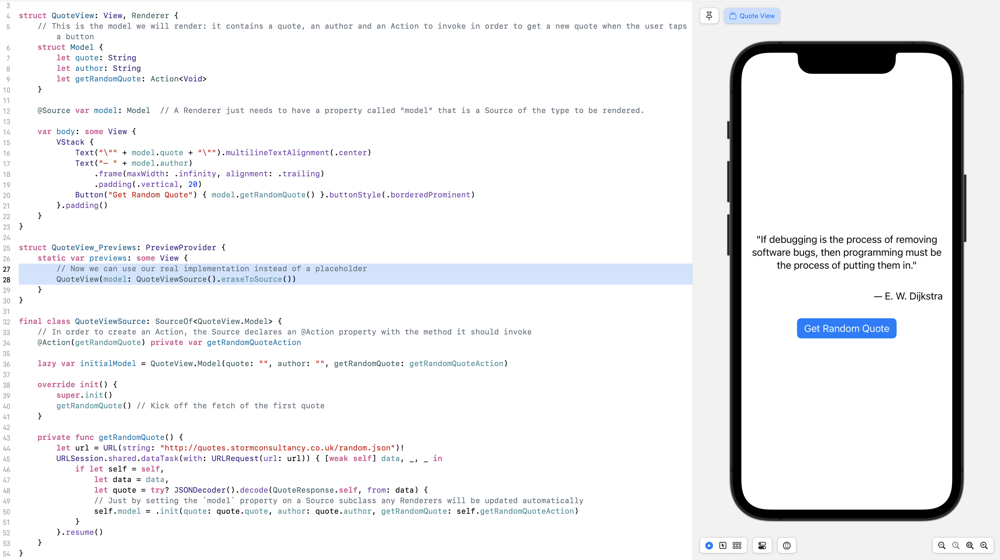

# Source Architecture

An incredibly streamlined framework for building reactive, highly-testable and scalable iOS apps. Source Architecture has a minimal footprint for use with new or existing code, and allows you to power screens built using UIKit or SwiftUI using exactly the same data sources.


## Overview

Source Architecture has only three core types:

- Source — a class that manages some piece of information like a user, a to do list item, or a persisted setting. A Source exposes a current value and also updates subscribers with new values.
- Renderer — a protocol for a screen or view that presents information to the user and handles user input. With Source Architecture a SwiftUI View, a UIViewController, a UITableViewCell or other types of UIViews can all be Renderers. A Renderer must simply have a property called `model` that is a Source of whatever information it wants to present, and a method called `render()` (not needed for SwiftUI Views)
- Action — a way to trigger some behavior in response to events or user input without needing to know where the behavior is implemented.

To give a simple example of all three types in use, here is how to build a Source and Renderer of a random quote. For this example we will use the endpoint: `http://quotes.stormconsultancy.co.uk/random.json`

First, we will decide what information will need to be shown by the Renderer and implement the View in SwiftUI:

```swift
import SwiftUI
import SourceArchitecture

struct QuoteView: View, Renderer {

  // This is the model we will render: it contains a quote, an author and an Action to invoke in order to get a new quote when the user taps a button
  struct Model {
    let quote: String
    let author: String
    let getRandomQuote: Action<Void>
  }

    // A Renderer just needs to have a property called "model" that is a Source of the type to be rendered.
  @Source var model: Model

  init(source: Source<Model>) {
      _model = source
  }

  var body: some View {
    VStack {
      Text("\"" + model.quote + "\"").multilineTextAlignment(.center)
      Text("— " + model.author)
          .frame(maxWidth: .infinity, alignment: .trailing)
          .padding(.vertical, 20)
      Button("Get Random Quote") { model.getRandomQuote() }.buttonStyle(.borderedProminent)
    }.padding()
  }
}
```


This is now a fully functioning screen that shows a quote, the author, and will trigger the retrieval and rendering of a new quote when the button is tapped! We can simply pass in a placeholder Source to the SwiftUI preview and see how it all works:


When the QuoteView is created, it needs to be passed a Source of its Model to render. In the example so far, we are just passing in a placeholder with fake data, but now let's actually create a real Source to retrieve quotes from the endpoint. First we create a subclass to be the Source of QuoteView's Model:

```swift
final class QuoteViewSource: SourceOf<QuoteView.Model> {
    
}
```


Next, we will create the Action that this Source will provide to get a new random quote:

```swift
final class QuoteViewSource: SourceOf<QuoteView.Model> {

  // In order to create an Action, the Source declares an @Action property with the method it should invoke
  @Action(QuoteViewSource.getRandomQuote) private var getRandomQuoteAction

  private func getRandomQuote() {
    let url = URL(string: "http://quotes.stormconsultancy.co.uk/random.json")!
    URLSession.shared.dataTask(with: URLRequest(url: url)) { [weak self] data, _, _ in
      if let self = self, 
         let data = data, 
         let quote = try? JSONDecoder().decode(QuoteResponse.self, from: data) {
        // Just by setting the `model` property on a Source subclass any Renderers will be updated automatically
        self.model = .init(quote: quote.quote, author: quote.author, getRandomQuote: self.getRandomQuoteAction)
      }
    }.resume()
  }
}
```


In order for the above JSON decoding to work, we need to create a Decodable QuoteResponse struct like this:

```swift
private struct QuoteResponse: Decodable {
    let quote: String
    let author: String
}
```


Lastly, subclassing `SourceOf` requires our Source to also define an initial value for its Model. We will add that property as well as an initializer that kicks off the initial fetch of a random quote:

```swift
final class QuoteViewSource: SourceOf<QuoteView.Model> {

  // In order to create an Action, the Source declares an @Action property with the method it should invoke
  @Action(QuoteViewSource.getRandomQuote) private var getRandomQuoteAction
  
  lazy var initialModel = QuoteView.Model(quote: "", author: "", getRandomQuote: getRandomQuoteAction)

	override init() {
    super.init()
    getRandomQuote() // Kick off the fetch of the first quote
  }

  private func getRandomQuote() {
    let url = URL(string: "http://quotes.stormconsultancy.co.uk/random.json")!
    URLSession.shared.dataTask(with: URLRequest(url: url)) { [weak self] data, _, _ in
      if let self = self, 
         let data = data, 
         let quote = try? JSONDecoder().decode(QuoteResponse.self, from: data) {
        // Just by setting the `model` property on a Source subclass any Renderers will be updated automatically
        self.model = .init(quote: quote.quote, author: quote.author, getRandomQuote: self.getRandomQuoteAction)
      }
    }.resume()
  }
}

private struct QuoteResponse: Decodable {
    let quote: String
    let author: String
}
```


That's it! We can now instantiate this real Source in our preview and see the screen render random quotes from the endpoint! The button works to get a new random quote as well. It's worth noting that you are free to use Combine publishers, async / await, Actors, or another other paradigm when working with Source Architecture. The only requirement a Source has ultimately is that it needs to 1) define an initial value for its model and 2) set its `model` property with new values when they should change.




So in about fifty lines of code we created a small app that displays a screen with a quote and author from a JSON endpoint, and a button that will fetch and display a new random quote when tapped. And got a quick look at the three core Source Architecture types of Source, Renderer and Action along the way.


## What's Different About Source Architecture?

- #### Model-defined API instead of Protocol-defined API

  Most architectural patterns rely on protocols to define what data and behaviors (API) will be available to client code. This is a perfectly workable approach, but it adds quite a bit of overhead in terms of creating the protocol and multiple conforming types. For example:

  ```swift
  protocol AuthenticationProvider {
    var isAuthenticated: Bool { get }
    var authToken: String? { get }
    var authError: Error? { get }
    func logInWithCredentials(_ credentials: Credentials)
    func logOut()
  }
  
  class AuthenticationManager: AuthenticationProvider {
    var isAuthenticated: Bool
    var authToken: String?
    var authError: Error?
    func logInWithCredentials(_ credentials: Credentials) {
       // Add implementation
    }
  
    func logOut() {
       // Add implementation
    }
  }
  
  class MockAuthenticationManager: AuthenticationProvider {
    var isAuthenticated: Bool
    var authToken: String?
    var authError: Error?
    func logInWithCredentials(_ credentials: Credentials) {
       // Add mock implementation
    }
  
    func logOut() {
       // Add mock implementation
    }
  }
  ```

  Protocol-based APIs like this can also run the risk of retain cycles, if for example the provider also retains the view.

  

  In contrast, Source Architecture defines all API in the Model types themselves. Models are structs or enums which contain both data and Actions. In contrast to the above protocol based appraoch, Source Architecture would expose the API like this:

  ```swift
  struct AuthenticationModel {
    let isAuthenticated: Bool
    let authToken: String?
    let authError: Error?
    let logInWithCredentials: Action<Credentials>
    let logOut: Action<Void>
  }
  ```

  
  Now, anything, regardless of protocol conformance can provide an instance or stream of these Models populated with the appropriate data and Actions. For example, in a test scenario instead of implementating a `MockAuthenticationManager` and conforming it to the AuthenticationProvider protocol, we can simply do this:
  
  ```swift
  let loginAction = Action<Credentials> { loginExpectation.fulfill() }
  let logOutAction = Action<Void> { XCTFail("logOut should not have been called") }
  let mockAuthenticationModel = AuthenticationModel(isAuthenticated: false, 
                                                    authToken: nil,
                                                    authError: nil,
                                                    logInWithCredentials: loginAction,
                                                    logOut: logOutAction)
  testSubject = .init(authModel: mockAuthenticationModel)
  ```
  
  No need for the overhead of creating protocols and conforming types, etc. Instead you can write less code and simpler code.
  
  Beyond saving extraneous code, the Model-defined approach allows for much better APIs which are self-documenting and require fewer tests. And many of these APIs are simply not possible with the protocol-defined approach. For example, in our AuthenticationProvider protocol above, there are implict rules that aren't clear to client developers. 
  
  - The `logOut()` method should only be called if `isAuthenticated == true`, otherwise it doesn't make sense
  - The `logInWithCredential()` method should only be called if `isAuthenticated == false`
  - The `authToken` property must ***always*** be `nil` if `isAuthenticated == false` and must ***never*** be nil if `isAuthenticated == true`
  - The `authError` property must ***always*** be `nil` if `isAuthenticated == true`


  All of these implicit rules must be implemented in every type conforming to the protocol, with defensive coding to check for the correct conditions. There also need to be extra unit tests written for every bullet point above.

  If only there were a way to make these rules explicit and guaranteed using the type system... and in Swift of course there is a way! Here is a **much** better way of modeling the API and the approach that Source Architecture was designed to support:
  ```swift
  enum AuthenticationModel {
    case notAuthenticated(NotAuthenticated)
    case authenticated(Authenticated)
    
    struct NotAuthenticated {
      let authError: Error?
      let logInWithCredentials: Action<Credentials>
    }
    
    struct Authenticated {
      let authToken: String
      let logOut: Action<Void>
    }
  }
  ```

  Notice that now the type system itself guarantees explicitly the four rules we stated above. The `logIn` and `logOut` actions can only be called in the right state and don't even exist in the wrong state. The `authToken` only exists in an `.authenticated` state and doesn't exist at all in the `.notAuthenticated` state. 

  So, by modeling the API this way, what have we improved?

  - The API is now self-documenting because now developers can see clearly what properties are available when and when each action is allowed to be called. In fact, it's not even _possible_ to accidentally call the wrong thing at the wrong time since autocomplete won't suggest it and the compiler won't accept it.

  - Eliminated the need to write defensive code to ensure that the write actions are only called at the right time

  - Eliminated the need to write at least 4 unit tests

  - As a bonus, we were able to remove optionality from the `authToken` property and don't need a separate `isAuthenticated` optional property anymore since that information is carried by the case itself. Less optionality means less conditional paths that developers to have to account for!


  In Source Architecture, everything is set up to make it easy to write and use Model-defined API while providing guarantees that Actions from previous states can't be saved and called later in the wrong state and ensuring that Actions are created and executed by the same Source that owns the data.


- #### Every Source is a simple state machine

  In Source Architecture, the basic unit of logic is a Source. A Source is the single source of truth for a piece of information and controls all modifications and transactions (saving, fetching, etc.) related to that information. As we saw above, our Models can have multiple states, with different Actions available in each state which are capable of transitioning the Model to a new state (like from `.notAuthenticated` to `.authenticated`)

  Source Architecture simplifies this greatly and saves a lot of boilerplace code involved in setting up such state machines. In order to implement a Source that manages the `AuthenticationModel` state we described above, it's as simple as:

  ```swift
  final class AuthManager: SourceOf<AuthenticationModel> {
    @Action(AuthManager.logIn) var logInAction // Connect Action to private method
    @Action(AuthManager.logOut) var logOutAction // Connect Action to private method
  
    // Specifiying an intial value for the model is the single CustomSource requirement
    lazy var initialModel: AuthenticationModel 
    		= .notAuthenticated(.init(error: nil, logInWithCredentials: logInAction))
  
    private func logOut() {
       model = .notAuthenticated(.init(error: nil, logInWithCredentials: logInAction))
    }
  
    private func logIn(_ credentials: Credentials) {
      // Send credentials to API and wait for response
      switch result {
      case .success(let token):
        model = .authenticated(.init(authToken: reponse.authToken, logOut: logOutAction))
      case .failure(let error)
        model = .notAuthenticated(.init(error: error, logInWithCredentials: logInAction))  
      }
    }
  }
  ```


  Now, any observer can get the current value of the AuthenticationModel, or get a stream of updated Models that are sent whenever the state changes:

  ```swift
  // We always erase the concrete type and just reference a Source of the Model
  let authSource: Source<AuthenticationModel> = AuthManager().eraseToSource
  
  // Get the the current value of the AuthenticationModel
  let currentModel = authSource.model
  
  // Subscribe to stream of Model changes
  authSource.subscribe(self, method: Self.handleAuthChange)
  func handleAuthChange(_ model: AuthenticationModel) {
    // This method will get called every time the model changes, with the latest value
  }
  ```

  

- #### UIKit works just like SwiftUI and is powered by the exact same Sources of data

  In Source Architecture, anything which should present updating data to the user (whether a UIViewController, a SwiftUI View, a UITableViewCell, etc.) simply conforms to the `Renderer` protocol. This protocol only requires that the view have an @Source property named "model" with the type of the Model the view wants to display (analagous to "view model" or "view state"). For SwiftUI Views, that's the only requirement, for non-SwiftUI views there must also be a method named `render()` which will be called automatically when the model is updated.

  Here is a simplified SwiftUI View which shows the status of a coworker, using Source Architecture:

  ```swift
  struct CoworkerStatus {
      let name: String
      let avatar: UIImage
      let isOnline: Bool
      let statusMessage: String
  }
  
  // Note the SourceArchitecture Renderer protocol
  struct StatusView: View, Renderer {
    // The Render protocol requires this property using the @Source property wrapper
  	@Source model: CoworkerStatus
  
    var body: some View {
      VStack {
        HStack {
          Circle()
            .foregroundColor(model.isOnline ? .green : .red)
            .frame(width: 10, height: 10)
          Image(model.avatar)
          Text(model.name)
        }
        Text(model.statusMessage)
    }
  }
  ```
  
  and here is a simplified example of a similar screen implemented as a UIViewController from a Storyboard:
  ```swift
  struct CoworkerStatus {
      let name: String
      let avatar: UIImage
      let isOnline: Bool
      let statusMessage: String
  }
  
  // Note the Renderer protocol again
  final class StatusView: UIVIewController, Renderer { 
    @IBOutlet private var image: UIImageView!
    @IBOutlet private var indicator: UIView!
    @IBOutlet private var name: UILabel!
    @IBOutlet private var statusMessage: UILabel!
  
    // Note that this is the same property wrapper used for both SwiftUI and UIKit
    @Source var model: CoworkerStatus
  
    // The method is required by the Renderer protocol and will be called automatically every time the Source updates the value of its CoworkerStatus model
    func render() {
      image.image = model.avatar
      indicator.backgroundColor = model.isOnline ? .green : .red
      name.text = model.name
      statusMessage.text = model.statusMessage
    }
  }
  ```


  As you can see, both UIKit and SwiftUI work the same simple way to implement the Renderer protocol and have a reactive live updating view:

  - Add a `@Source` property named `model` with the type your view will render. This should almost always be passed into your view from outside (initializer injected) rather than created internally, to allow for pulling data from APIs, testing, etc.
  - For non-SwiftUI views create a `render()` method that updates the UI with values from the model. This method will be called automatically every time the model updates. For SwiftUI, the `body` property already fulfills this role and there is no need to implement a separate `render()` method.

  It's also important to note that the ***same*** Source of CoworkerStatus can be injected into both the UIKit and SwiftUI views and power them both the same way.


- #### Powerful set of built-in Models and Sources, but easy to extend and build your own reusable elements as well

  Source Architecture includes a set of powerful and flexible generic Models:

  - `Fetchable<Value>`: a model that describes a value that is retrieved over a network. The model has three possible states of a value — `.fetching`, `.fetched` and `.failure`. Failures can optionally include a retry Action, along with an error and count of failed attempts. The fetched state also includes a refresh Action to get the latest value.
  - `Persistable<Value>`: a model that describes any kind of persisted value, whether it be using cache, file, keychain, user defaults, database, or other persistence mechanisms. The Persistable model has two state: `.found` and `.notFound`. Either state allows a new value to be saved via the set Action, and the found state also includes an Action to clear the persisted value and a property to detemine if the found value is stale or expired.
  - `CurrentAndPrevious<Value>`: a model that includes both a current instance of the Value, as well as an optional previous instance.
  - `Connectable<Value>`: a model that described two possible states of a value — `.connected` and `.disconnected`. This allows any resources needed to manage the value to be deferred and not created until connection and for any underlying resources to be released when the value is disconnected.

  Source Architecture Sources themselves are intended to be easily composed and transformed, similar to Combine Publishers or other Reactive frameworks. Using extensions on the Source type based on that Source's Model, many different conveniences and powerful behaviors can be easily composed together. A small sampling of some of the built in Source extensions included in Source Architecture includes:

  - For any Sources that have a Fetchable model (retrieved from a network endpoint), the following extensions are automatically available:

    - `.retrying()` - Will retry the network request using the specified strategy up to the specified number of times, until it succeeds
    - `.persisted(using:)` - Will use a provided Source to persist the response received from the network and to retrieve any previously persisted value before attempting to fetch from the network
    - `.combinedFetch(with:)` - Accepts a second Source of a Fetchable<Value> and returns a new Source of a Fetchable<(FirstValue, SecondValue)> that will combined the results of both network requests into a single result.

  - For any Source:

    - `.currentAndPrevious()` - Returns a Source that will relay both the current and previous value of the original Source
    - `.filtered()` - Returns a Source that will only publish value that match the filter criteria
    - `.map()` - Returns a Source that transforms the original value to a new kind of value

    - `._printingUpdates()` - Used for debugging, will print every update to the Source's model to the console


  In addition to the provided extensions, it's extremely easy to create your own custom extensions to fit your own team or project requirements. For example, you could add an extension that will automatically log errors from any Source of a Model that conforms to a protocol called "Errorable":

  ```swift
  protocol Errorable {
    var error: Error? { get }
  }
  
  /// A custom Source that observes an input Source whose Model conforms to Errorable, and if the value of the model ever has an error, logs it.
  final class ErrorLoggingSource<Model: Errorable>: SourceOf<Model> {
    @Source var input: Model
    var initialValue: Model { input }
    init(_ inputSource: Source<Model>) {
      _input = inputSource
      super.init()
      _input.subscribe(self, ErrorLoggingSource.logErrorIfPresent)
    }
  
    func logErrorIfPresent(value: Model) {
      if let error = value.error {
         // Use some custom logging method for your app to log this error
      }
      model = value
    }
  }
  
  /// Add an extension to any Source of a Model that conforms to Errorable to return a version of it that logs all errors
  extension Source where Model: Errorable {
    func loggingErrors() -> Source<Model> {
      ErrorLoggingSource(self).eraseToSource()    
    }
  }
  
  /// Example usage, let's conform the built-in Fetchable<Value> type to be Errorable
  extension Fetchable: Errorable {
    var error: Error? {
      if case .failure(let failure) = self 
        return failure.error
      }
      return nil
    }
  }
  
  /// Now we can automatically log any errors fetching Network resources
  let userSource: Source<User> = FetchableDataSource(urlRequest: .init(userProfileURL))
                                   .eraseToSource()
                                   .jsonDecoded()  // Decodes a User struct from the data
                                   .loggingErrors() // Will automatically log errors as implemented above
  ```

  

- #### Composable business logic

- #### Extremely easy to test

  


## Frequently Asked Questions:


## Next Steps:


